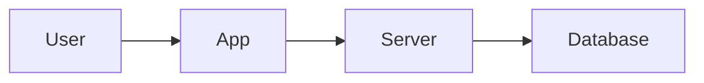
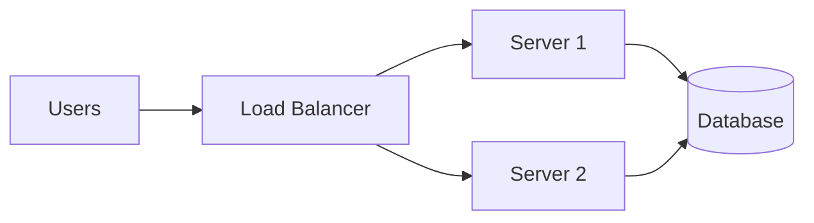

## Why This Question Even Matters

You build an app.  
It works fine for you and a few friends.

Then more people join.  
Suddenly, it slows down.  
One day, it crashes completely.

Nothing “changed” in your code, so what actually broke?

This is the question **system design** tries to answer.

## The Real Problem Behind Growing Software

Most software doesn’t fail because of bad logic.

It fails because:
- too many users arrive at once  
- too much data piles up  
- one small failure brings everything down  

System design is about **preparing for these moments before they happen**.

## A Simple Story: The Tea Stall

Imagine running a small tea stall.

At first:
- one kettle  
- one person serving  
- everything works  

As customers grow:
- waiting increases  
- mistakes happen  
- people leave angry  

The tea didn’t change.  
The **system of making and serving tea did**.

That is system design.

## So, What Is System Design?

**System design** is the practice of deciding:
- how different parts of a system talk to each other  
- how work is divided  
- how failures are handled  
- how growth is supported  

All **before** the system is under pressure.

## A Very Simple System

Let’s look at the most basic setup.

This works beautifully... until it doesn’t.

## Where This Starts Breaking

As usage grows:

- the server gets overloaded
- the database slows down
- if the server crashes, everything stops

This is called a single point of failure.

## How Systems Learn to Survive

Now we evolve the design.

Now:

- traffic is distributed
- failures are contained
- growth becomes manageable

This evolution is **system design in action**.

## A Real Example You Already Use

Think about UPI payments.
- Millions of users
- Heavy traffic during festivals
- Near-zero tolerance for failure

UPI works not because it’s fast, but because it’s designed to survive failures.

>
System design is about making software work reliably as users, data, and failures grow.
{: .prompt-tip }

## What’s Coming Next?
We’ll clear a very common confusion:

**Latency vs Throughput**

Why systems can be fast and still feel slow.
