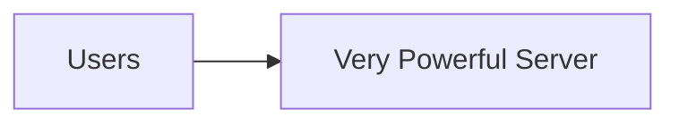
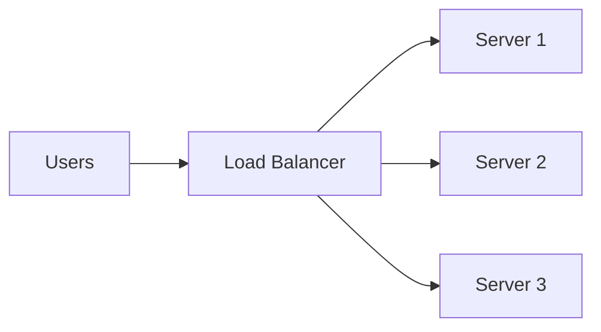

## Why This Question Matters

Your system is struggling.

Requests are slow.  
Errors are increasing.  
Users are growing.

The first instinct is simple:
> “Let’s add more power.”

But **how** you add that power changes everything.

## The Core Decision

When a system needs to handle more load, there are only two fundamental choices:

- Make one machine **bigger**
- Add **more machines**

These two paths are called **vertical scaling** and **horizontal scaling**.

## A Simple Story: The Kitchen

Imagine a small restaurant kitchen.

Orders increase.

You have two options:

1. Buy a **bigger, more powerful stove**
2. Add **more stoves and cooks**

Both increase output — but in very different ways.

## Vertical Scaling (Scaling Up)

**Vertical scaling** means:
> Making a single machine more powerful.

Examples:
- More CPU
- More RAM
- Faster disk

### What This Feels Like
- Simple
- Quick to implement
- No architecture changes

### The Hidden Limit
There is always a **maximum size** a machine can reach.

When it fails, **everything fails**.

## Horizontal Scaling (Scaling Out)

**Horizontal scaling** means:
> Adding more machines to share the load.

### What This Feels Like
- Slightly more complex
- Requires coordination
- Needs load balancing

### The Big Advantage
You can keep adding machines as demand grows.

Failures are **contained**, not catastrophic.

## Where Systems Usually Start — and End

Most systems begin with:
- vertical scaling (easy wins)

Mature systems move toward:
- horizontal scaling (long-term survival)

This transition is one of the **most important moments** in system design.

## A Real Example You’ve Seen

Early-stage apps often run on:
- one big server

Large platforms run on:
- thousands of small servers working together

The second approach is how systems grow without collapsing.

>
**Vertical scaling = grow up (bigger machine)**  
**Horizontal scaling = grow out (more machines)**  
Growth without sharing always hits a ceiling.
{: .prompt-tip }

## 🤔 Think About This

If one powerful server can handle today’s load,  
what happens the day it crashes?

## What’s Coming Next

Next, we’ll look at a quiet but dangerous problem:

**Single Point of Failure**  
How one small component can bring everything down.
