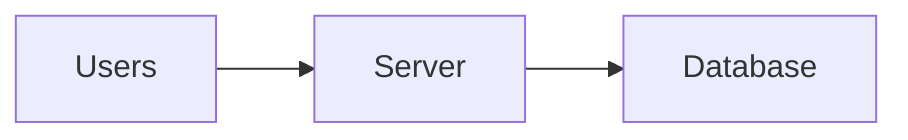
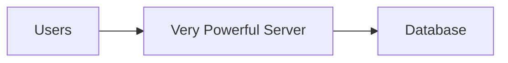
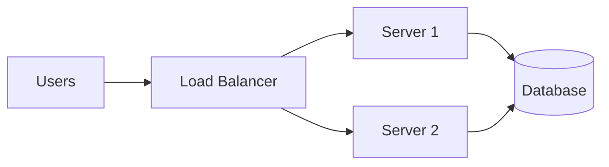

## Why This Problem Is Dangerous

Your system works fine.

Users are happy.  
Traffic is steady.  
Everything feels under control.

Then **one small thing fails**.

Suddenly:
- the app is down
- users can’t log in
- payments stop working

Not because the system was complex —  
but because it depended on **one thing too much**.

## The Quiet Risk Most Systems Start With

Most early systems look like this:

Simple.  
Clean.  
Easy to reason about.

But this design hides a risk:
if **Server** goes down, everything goes down.

That server is a **single point of failure**.

## What Is a Single Point of Failure?

A **single point of failure** is:

> Any component whose failure  
> causes the entire system to stop working.

It doesn’t have to be big.
It just has to be **required**.

## A Simple Story: The Only Key

Imagine an office with:
- one door
- one lock
- one key

Lose the key.

The office still exists.  
People are still there.  
Work still needs to happen.

But **nothing can move**.

That key is the single point of failure.

## Why Vertical Scaling Makes This Worse

When we scale **vertically**, we often do this:

The server is:
- faster
- stronger
- more expensive

But it’s still **one machine**.

If it crashes:
- performance doesn’t matter
- power doesn’t matter

Everything stops.

## How Systems Remove Single Points of Failure

The fix is usually simple in concept:
> **Don’t rely on just one of anything important.**

Now:
- one server can fail
- traffic still flows
- users might not even notice

The system becomes **resilient**, not perfect.

## Where Single Points Still Hide

Even in distributed systems, SPOFs can exist:
- one database instance
- one message queue
- one region
- one credentials store

They’re dangerous because they’re **easy to forget**.

> 
A system doesn’t fail when everything breaks.  
It fails when **one required thing** breaks.
{: .prompt-tip }

## 🤔 Think About This

If one component disappears tonight,  
what part of your system would stop completely?

## What’s Coming Next

Next, we look at a related but subtle idea:

**Stateless vs Stateful Systems**  
Why remembering things can make systems fragile.

