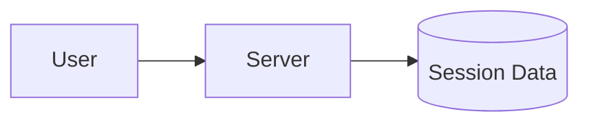
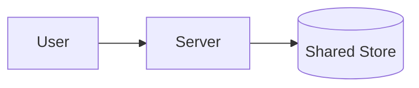

## Why This Difference Matters

Your system is running fine.

Requests are flowing.  
Users are active.  
Everything feels stable.

Then one server restarts.

Suddenly:
- users are logged out
- carts are empty
- sessions are lost

Nothing “crashed”.  
But something important disappeared: **memory**.

## The Question We Rarely Ask

When a request reaches a server, there’s a quiet but critical question hiding underneath:

> *Does this server need to remember anything about the user?*

The answer decides whether your system is **stateful** or **stateless** —  
and it changes how your system behaves under failure and scale.

## A Simple Story: The Notebook Counter

Imagine a small food counter.

### Stateful Counter

The vendor keeps a **notebook**:
- remembers who ordered what
- tracks unpaid bills
- recognizes repeat customers

As long as the notebook is there, things work.

If the vendor leaves **with the notebook**,  
everything stops.

### Stateless Counter

Now imagine a different setup:
- every customer carries their own order slip
- the vendor only reads what’s handed over

If the vendor changes,  
the counter keeps running.

Nothing important was tied to one person.

## What Is a Stateful System?

A **stateful system**:
- remembers past interactions
- stores session data locally
- depends on memory between requests

If that server fails or restarts,  
the memory goes with it.

This makes stateful systems:
- easier to start with
- harder to scale
- fragile during failures

## What Is a Stateless System?

A **stateless system**:
- treats every request as independent
- stores shared data outside the server
- does not rely on local memory

Any server can handle any request.

This makes stateless systems:
- easier to scale horizontally
- resilient to restarts
- better suited for distributed systems

## Where Systems Really Feel the Difference

Stateful systems struggle when:
- servers are added or removed
- load is distributed
- failures occur unexpectedly

Stateless systems shine because:
- requests can go anywhere
- failures are absorbed quietly
- scaling becomes predictable

This is why **modern systems strongly prefer stateless designs** wherever possible.

## A Real Example You’ve Experienced

Think about logging into a website.

If you get logged out when:
- a server restarts
- traffic spikes
- requests are retried

The system is likely **stateful**.

If your session survives all of that,  
the system was designed to be **stateless**.

>
**Stateful systems remember users.**  
**Stateless systems remember rules.**  
Memory makes systems convenient — and fragile.
{: .prompt-tip }

## 🤔 Think About This

If one server disappears right now,  
what user information disappears with it?

## As Discussed Earlier in This Series

This idea connects directly to concepts we’ve already covered:

- Why tying memory to one server makes failures catastrophic: [Single point of failure](https://vivekmolkar.com/posts/single-point-of-failure/)

- Why stateless systems scale out more naturally: [Horizontal vs Vertical Scaling](https://vivekmolkar.com/posts/horizontal-vs-vertical-scaling/)

- Why adding speed doesn’t fix memory-bound designs: [Scalability vs Performance](https://vivekmolkar.com/posts/scalability-vs-performance/)

---

## What’s Coming Next

Next, we zoom out and look at the foundation beneath all of this:

**Client–Server Model**  
Who really does what — and why that separation matters.
