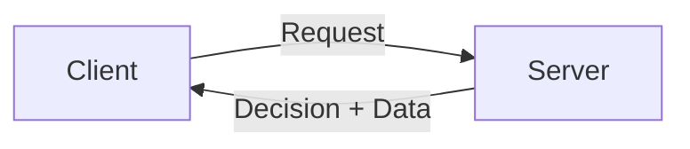

## Why This Question Matters Now

Up to this point, we’ve talked about:
- scaling systems
- removing single points of failure
- avoiding server-side memory
- surviving growth

All of that quietly assumes one thing:
that different parts of the system have **different responsibilities**.

System design starts breaking down when this boundary becomes unclear.

## A Familiar Situation

You open a food delivery app.

You:
- choose items
- add an address
- tap “Place Order”

Then you wait.

If something goes wrong, you don’t think:
> “Maybe I tapped the button wrong.”

You think:
> “The system messed up.”

That expectation already assumes a **client–server relationship**.

## The Core Idea (Without Jargon)

The model is simple:

- **Clients ask**
- **Servers decide**

Clients:
- send requests
- show results
- retry when things fail

Servers:
- validate requests
- apply business rules
- store the source of truth

Confuse this separation, and systems become fragile.

## A Simple Story: Ordering at a Café

Imagine a café.

### The Customer (Client)
- chooses the drink
- communicates the order
- waits for the outcome

### The Barista (Server)
- knows how to make the drink
- checks ingredient availability
- ensures correctness

If customers start deciding:
- prices
- recipes
- availability

Chaos follows.

Software systems behave the same way.

## What Clients Are Good At

Clients are good at:
- collecting input
- rendering interfaces
- handling retries
- being replaceable

Clients are **not trusted**.

They can:
- be slow
- be buggy
- be malicious
- disappear without notice

Systems are designed with this assumption.

## What Servers Must Own

Servers are responsible for:
- validation
- business rules
- consistency
- data integrity

If something must be correct,
it must be enforced on the **server**.

Anything else is only a convenience.

## Seeing the Boundary Clearly

The client initiates.  
The server decides.

This clean boundary enables:
- stateless servers
- horizontal scaling
- safe retries

## Where Systems Get This Wrong

Problems appear when:
- clients hold critical logic
- servers trust client calculations
- responsibilities leak across the boundary

These systems often work at small scale,
and then fail in surprising ways.

## How This Connects to Earlier Concepts

- **Stateless vs Stateful Systems**  
  Servers should not depend on remembering clients.

- **Single Point of Failure**  
  Clients are replaceable; servers must be resilient.

- **Horizontal Scaling**  
  Clear responsibilities allow any server to handle any request.

This model quietly supports everything we’ve discussed so far.

> 
**Clients ask.**  
**Servers decide.**    
Responsibility boundaries make systems scalable.
{: .prompt-tip }

## 🤔 Think About This

If a client lies, retries, or disappears,
does your system still behave correctly?

If not, the boundary is wrong.

## What’s Coming Next

Now that roles are clear, the next question is natural:

**Load Balancing**  
How does the system decide *which* server handles a request?
