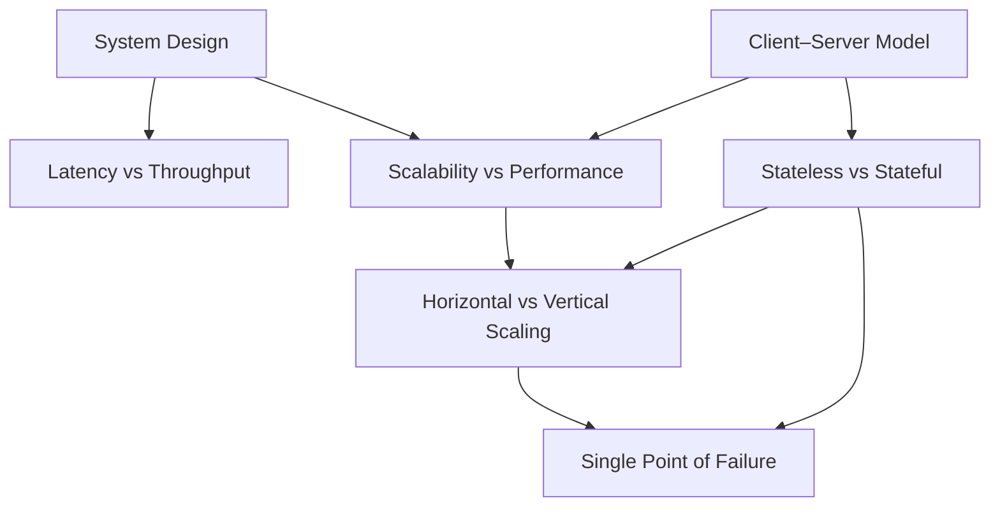

## Why This Summary Exists

System design is not about memorizing components.

It’s about understanding **how ideas connect** when systems grow,
fail, and evolve under pressure.

Over the last few posts, we built the foundation step by step.
This post ties those ideas into **one mental map**.

## The Foundation Map

## How to Read This Diagram

This diagram is **not a sequence**.
It’s a **relationship map**.

- **Latency vs Throughput** explains why systems *feel* slow  
- **Scalability vs Performance** explains why optimizations hit limits  
- **Horizontal vs Vertical Scaling** shows *how* systems grow  
- **Single Point of Failure** reveals what brings systems down  
- **Stateless vs Stateful** explains why memory complicates scale  
- **Client–Server Model** defines responsibility boundaries  

Together, they explain why some systems survive growth — and others don’t.

## The Core Insight

These concepts reinforce each other:

- Stateless systems make horizontal scaling possible  
- Horizontal scaling reduces single points of failure  
- Clear client–server boundaries enable statelessness  
- Scalability decisions matter more than raw performance  

This is the **foundation mindset** of system design.

## Where to Go Deeper

Each idea above is explored individually here:

- **Latency vs Throughput**  
  [https://vivekmolkar.com/posts/latency-vs-throughput/](https://vivekmolkar.com/posts/latency-vs-throughput/)

- **Scalability vs Performance**  
  [https://vivekmolkar.com/posts/scalability-vs-performance/](https://vivekmolkar.com/posts/scalability-vs-performance/)

- **Horizontal vs Vertical Scaling**  
  [https://vivekmolkar.com/posts/horizontal-vs-vertical-scaling/](https://vivekmolkar.com/posts/horizontal-vs-vertical-scaling/)

- **Single Point of Failure**  
  [https://vivekmolkar.com/posts/single-point-of-failure/](https://vivekmolkar.com/posts/single-point-of-failure/)

- **Stateless vs Stateful Systems**  
  [https://vivekmolkar.com/posts/stateless-vs-stateful/](https://vivekmolkar.com/posts/stateless-vs-stateful/)

- **Client–Server Model**  
  [https://vivekmolkar.com/posts/client-server-model/](https://vivekmolkar.com/posts/client-server-model/)

## A Closing Thought

If these ideas feel obvious now,
that’s a good sign.

Strong foundations make complex systems
feel natural instead of intimidating.
