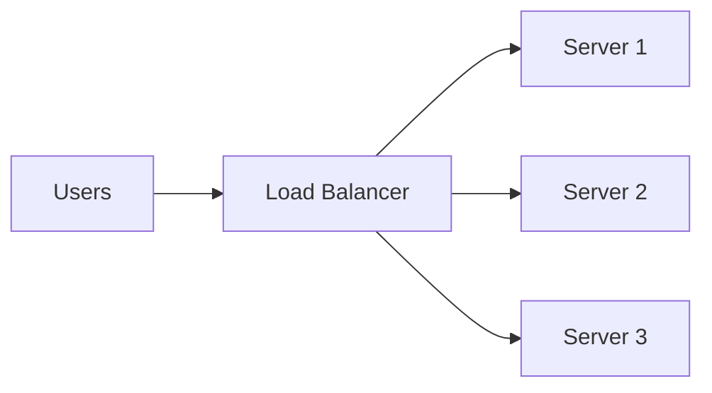

## Why This Question Suddenly Matters

You now have:
- multiple servers
- stateless requests
- clear client–server boundaries

Everything looks ready to scale.

Then traffic increases.

And a quiet question appears:

> **Which server should handle this request?**

If the answer is vague,  
you already have a scaling problem.

## A Situation You’ve Definitely Experienced

You refresh a website.

Sometimes it’s fast.  
Sometimes it’s slow.  
Sometimes it fails and works on retry.

Nothing obvious changed.

What actually changed is **which server** handled your request.

Load balancing is the invisible decision behind that experience.

## The Core Problem (No Jargon)

If all requests hit one server:
- that server overloads
- others sit idle
- failures cascade

If requests are spread **intelligently**:
- work is shared
- failures are absorbed
- performance stabilizes

Load balancing is simply:

> **Deciding where each request goes — on purpose.**

## A Simple Story: Multiple Checkout Counters

Imagine a supermarket.

There are:
- 5 checkout counters
- 20 customers arriving together

### No Load Balancing
Everyone lines up at the first counter.

Result:
- one long queue
- empty counters
- growing frustration

### With Load Balancing
Customers are guided to:
- the shortest queue
- the next available counter

Same people.  
Same counters.  
Completely different outcome.

That guidance is load balancing.

## What a Load Balancer Actually Does

A load balancer sits **in front of servers**.

Its job is not business logic.

Its job is to:
- receive requests
- choose a server
- forward the request
- stay invisible

## How Does It Choose?

Common strategies include:
- **Round Robin** — take turns
- **Least Connections** — pick the least busy
- **Random** — surprisingly effective at scale
- **Sticky Sessions** — same client → same server

Each has trade-offs.

## ⚠️ Common Trap

**Trap:** Using sticky sessions to “fix” session problems.

This often hides a **stateful design flaw**  
and quietly creates new single points of failure.

## Why Load Balancing Enables Everything Else

Without load balancing:
- horizontal scaling doesn’t help
- stateless servers don’t matter
- failures hurt more than they should

With good load balancing:
- traffic spreads naturally
- unhealthy servers are skipped
- systems degrade gracefully

Load balancing is the **gatekeeper of scale**.

## A Real Failure You’ve Seen

In several large outages across major platforms,
traffic continued flowing **to unhealthy servers**.

The result wasn’t total downtime —
it was *partial, confusing failure*:
- some users worked
- others didn’t
- retries made things worse

Poor load balancing amplifies failures instead of containing them.

## How This Connects to What We’ve Learned

- **Client–Server Model**  
  Clients don’t pick servers — the system does.  
  [https://vivekmolkar.com/posts/client-server-model/](https://vivekmolkar.com/posts/client-server-model/)

- **Stateless vs Stateful Systems**  
  Stateless servers make load balancing safe.  
  [https://vivekmolkar.com/posts/stateless-vs-stateful/](https://vivekmolkar.com/posts/stateless-vs-stateful/)

- **Single Point of Failure**  
  A single load balancer can itself become an SPOF if not designed carefully.  
  [https://vivekmolkar.com/posts/single-point-of-failure/](https://vivekmolkar.com/posts/single-point-of-failure/)

- **Horizontal vs Vertical Scaling**  
  Load balancing is what makes horizontal scaling actually work.  
  [https://vivekmolkar.com/posts/horizontal-vs-vertical-scaling/](https://vivekmolkar.com/posts/horizontal-vs-vertical-scaling/)

>
 **Load balancing isn’t about speed.**  
It’s about fairness, resilience, and predictability.
{: .prompt-tip }

## 🧪 Mini Exercise

Take a system you’ve worked on.

1. List **3 components** that receive traffic  
2. Ask: *How is traffic distributed today?*  
3. Identify **one failure case** where traffic would make things worse instead of better  

You’ll quickly see how mature your load balancing is.

## What’s Coming Next

Now that requests are distributed fairly,  
another question appears:

> **Where should logic live *before* it reaches the servers?**

Next up: **Reverse Proxy**  
Why many systems quietly rely on a middle layer you never notice.
