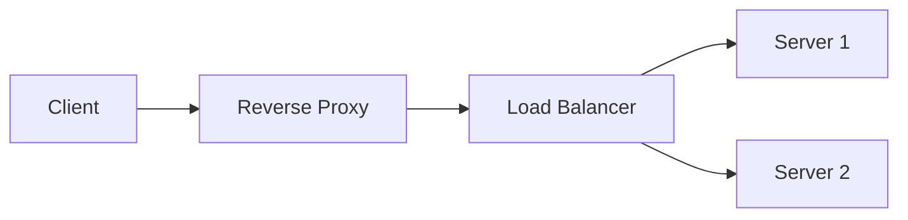

## Why This Layer Exists (Even If You Didn’t Plan It)

Your system is growing.

You now have:
- multiple backend servers
- load balancing in place
- traffic increasing steadily

Clients are no longer talking to a single server.

But here’s the quiet truth:

> Clients rarely talk to your servers directly.

There’s almost always something in between.

That something is a **reverse proxy**.

## A Situation You’ve Definitely Experienced

You type a website URL.

The page loads.  
Images appear.  
APIs respond.

You never know:
- which server handled the request
- where SSL was terminated
- where caching happened

And you were never supposed to know.

That invisibility is the reverse proxy doing its job.

## The Core Idea (Without Definitions)

A reverse proxy:
- sits in front of servers
- receives requests from clients
- decides what happens next

To the client,  
the reverse proxy *is* the system.

To the servers,  
it’s a traffic manager and shield.

## A Simple Story: The Reception Desk

Imagine a large office building.

Visitors don’t walk directly to employees.

They first stop at a reception desk.

The receptionist:
- checks who the visitor is
- decides where to send them
- blocks unauthorized access
- answers simple questions

Employees focus on actual work.

That reception desk is a reverse proxy.

## What a Reverse Proxy Actually Does

A reverse proxy can:
- route requests to backend servers
- terminate SSL
- cache responses
- block malicious traffic
- hide internal architecture

It centralizes cross-cutting concerns  
that don’t belong in business logic.

## How It’s Different from Load Balancing

This confusion is common.

- **Load Balancer** → decides *which server*
- **Reverse Proxy** → decides *what happens to the request*

They often live together.  
Sometimes they are the same component.

But the intent is different.

## ⚠️ Common Trap

**Trap:** Putting business logic in the reverse proxy.

Reverse proxies are powerful,  
but pushing application logic into them creates:
- tight coupling
- debugging nightmares
- hidden behavior

They should mediate — not decide business outcomes.

## A Real Failure You’ve Probably Seen

Many large outages were not caused by backend crashes.

They were caused by:
- misconfigured proxies
- expired certificates
- bad routing rules
- cache poisoning

When the reverse proxy fails,  
everything behind it becomes unreachable —  
even if servers are healthy.

## How This Connects to What We’ve Learned

- **Load Balancing**  
  Reverse proxies often sit before or alongside load balancers.  
  https://vivekmolkar.com/posts/load-balancing/

- **Client–Server Model**  
  Clients talk to the proxy, not directly to servers.  
  https://vivekmolkar.com/posts/client-server-model/

- **Single Point of Failure**  
  A single reverse proxy can become a choke point if not replicated.  
  https://vivekmolkar.com/posts/single-point-of-failure/

>
**Reverse proxies don’t add features.**  
They remove complexity from everything else.
{: .prompt-tip }

## 🧪 Mini Exercise

Think about a system you know.

1. Where does SSL terminate?
2. Where does routing happen?
3. Where would you block bad traffic today?

If all answers point to application code,  
a reverse proxy is missing.

## What’s Coming Next

Now that traffic is mediated and routed,  
another question appears:

> Why do some requests never reach the servers at all?

Next: **Caching**  
How systems get faster by responding without working.
