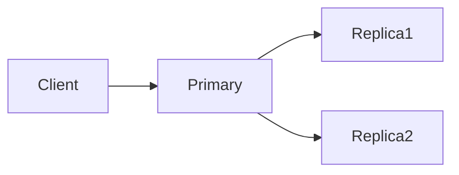

## When One Copy Isn’t Enough

Your system works.

Until it doesn’t.

A server crashes.  
A disk fails.  
A network blips.

Suddenly, everything depends on a single copy of data.

That’s when replication enters the picture.

## The Core Idea

Replication means **keeping multiple copies of the same data**.

Why?
- to survive failures
- to improve availability
- to protect against single points of failure

But copying data is never free.

It always introduces a new problem:

> **How do we keep copies in sync?**

## A Simple Story: Shared Notes

Imagine two people sharing notes for the same class.

Each keeps a copy.

If one notebook is lost, the other survives.  
That’s resilience.

But if both people update their notes independently,  
differences creep in.

Now they must:
- compare
- reconcile
- decide which version is correct

That’s replication in systems.

## Why Systems Replicate Data

Replication is usually introduced to:
- avoid single points of failure
- keep systems available during crashes
- survive hardware and network issues

One copy is fragile.  
Many copies are safer.

But safety comes with coordination costs.

## 🔍 Replication vs Scaling (Important Clarification)

Replication and scaling often appear together,  
which is why they’re easy to confuse.

But they solve **different problems**.

**Replication answers:**  
> *What happens when something fails?*

**Scaling answers:**  
> *What happens when traffic grows?*

Replication is about **resilience and availability**.  
Scaling is about **handling more load**.

Replication *can* help with read scaling —  
but that’s a side effect, not the primary goal.

A system can:
- be replicated and still not scale writes
- scale reads without strong replication guarantees
- scale vertically without replication at all

## One-Line Mental Model

> **Scaling handles growth.  
> Replication handles failure.**

When systems use replication *for* scaling,  
they accept weaker consistency as the cost.

## Replication and Reads vs Writes

Replication favors **read-heavy workloads**.

Reads can go to any replica.  
Writes usually cannot.

Most systems therefore:
- allow many replicas to serve reads
- restrict writes to a primary copy

This keeps writes ordered —  
but slows them down.

## Visualizing Replication

Reads can come from replicas.  
Writes flow through the primary.

Simple.  
Predictable.

But not perfectly synchronized.

## Where Disagreement Comes From

Updates don’t reach all replicas instantly.

For a short time:
- one replica has new data
- another has old data

This is not a bug.

It’s the cost of copying data across space and time.

Replication makes **eventual consistency unavoidable**.

## ⚠️ Common Trap

**Trap:** Assuming replicas are always identical.

They are intended to be identical —  
eventually.

Designing systems as if replicas are always perfectly in sync  
leads to subtle correctness bugs.

## A Situation You’ve Likely Seen

Have you noticed:
- read replicas lagging behind?
- dashboards showing slightly old values?
- failovers causing brief confusion?

That’s replication revealing itself.

Not failure.  
A trade-off.

## How This Connects to What We’ve Learned

- **Read-Heavy vs Write-Heavy Systems**  
  Replication helps reads far more than writes.  
  [https://vivekmolkar.com/posts/read-heavy-vs-write-heavy-systems/](https://vivekmolkar.com/posts/read-heavy-vs-write-heavy-systems/)

- **Consistency Models**  
  Replication creates windows of disagreement.  
  [https://vivekmolkar.com/posts/consistency-models/](https://vivekmolkar.com/posts/consistency-models/)

- **Databases vs Caches**  
  Replicas copy truth — they don’t redefine it.  
  [https://vivekmolkar.com/posts/databases-vs-caches/](https://vivekmolkar.com/posts/databases-vs-caches/)

Replication is where many system design tensions meet.

>
**Replication improves availability.  
It weakens immediate agreement.**
{: .prompt-tip }

## 🧪 Mini Exercise

Think about a replicated system you’ve used.

1. Where do writes go?
2. Where do reads go?
3. What happens if replicas lag?

If you can answer these,  
you understand replication better than most.

## What Comes Next

Once systems need more capacity, not just more copies…

> **How do we split data so no single database has to handle everything?**

Next: **Sharding**  
How systems divide data, and why it’s harder than it looks.

