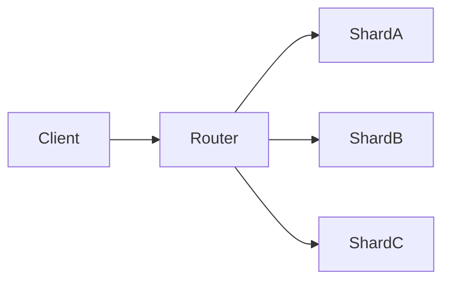

## When Copies Still Aren’t Enough

Replication helped.

Your system survives failures.  
Reads scale nicely.

But something still hurts.

Writes queue up.  
Indexes grow slower.  
Storage keeps expanding.

Even a perfectly healthy database  
has physical limits.

At this point, copying data doesn’t help.

You need to **divide responsibility**.

## The Core Idea (Very Plain)

**Sharding means splitting data into parts**  
and storing each part on a different machine.

Instead of:
- one database owning everything

You get:
- many databases, each owning a slice

Each shard is responsible for **only its own data**.

Together, they form the full dataset.

## Sharding vs Replication (No Confusion)

Let’s lock this distinction clearly.

- **Replication**  
  Copies the *same* data  
  → improves availability and read capacity

- **Sharding**  
  Splits *different* data  
  → improves write capacity and storage limits

Replication duplicates responsibility.  
Sharding divides responsibility.

They are often used together —  
but they solve different problems.

## Visualizing Sharding

Every request is routed  
to the shard that owns that data.

No shard has the full picture.  
Together, they scale.

## A Simple Story: Filing Cabinets

Imagine one huge filing cabinet.

As files grow, drawers get heavy.  
Finding anything becomes slow.

So you add more cabinets.

Each cabinet holds:
- only certain files
- based on a clear rule

No cabinet has everything.  
But together, they store it all.

That’s sharding.

## How Systems Decide Where Data Goes

Every sharded system needs a rule:

> **Given a piece of data,  
> which shard owns it?**

Common approaches (intuition only):
- hashing an ID
- splitting by ranges (A–F, G–M…)
- partitioning by user or tenant

This decision is **sticky**.

Changing it later usually means:
- moving large amounts of data
- downtime or complex migrations

## Why Sharding Is Hard

Sharding introduces new challenges:

- queries that span shards  
- transactions across shards  
- uneven data distribution (hot shards)  
- operational complexity  

Replication introduced **disagreement**.  
Sharding introduces **fragmentation**.

You trade simplicity for capacity.

## ⚠️ Common Trap

**Trap:** Sharding too early.

Sharding:
- increases operational overhead
- complicates queries
- makes transactions harder

Many systems scale far with:
- vertical scaling
- caching
- replication

Sharding should be a **structural last step**,  
not an early optimization.

## How This Connects to What We’ve Learned

- **Read-Heavy vs Write-Heavy Systems**  
  Sharding is usually driven by write pressure.  
  [https://vivekmolkar.com/posts/read-heavy-vs-write-heavy-systems/](https://vivekmolkar.com/posts/read-heavy-vs-write-heavy-systems/)

- **Replication**  
  Often applied *inside* each shard for safety.  
  [https://vivekmolkar.com/posts/replication/](https://vivekmolkar.com/posts/replication/)

- **Databases vs Caches**  
  Shards still decide truth — caches don’t.  
  [https://vivekmolkar.com/posts/databases-vs-caches/](https://vivekmolkar.com/posts/databases-vs-caches/)

Sharding changes **where data lives**,  
not **what is correct**.

> 
**Replication copies data.  
Sharding splits data.**
{: .prompt-tip}

## 🧪 Mini Exercise

Think about a growing system.

1. What key could data be split on?
2. Would queries often need multiple shards?
3. What happens if one shard is slow or down?

If these questions feel uncomfortable,  
that’s the real cost of sharding.

## What Comes Next

Once data is split across machines…

> **What happens when a request waits too long — or retries make things worse?**

Next: **Timeouts, Retries, and Backpressure**  
Why time becomes the most important failure mode.

