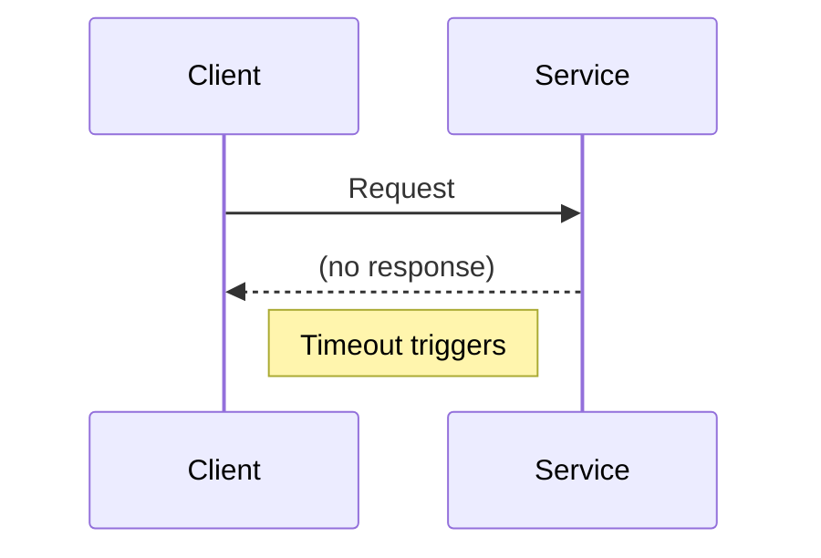

## When Nothing Is “Broken”… Yet Everything Is Down

The system is up.

Servers are running.  
No errors in logs.  
Dashboards look green.

But requests are slow.  
Queues are growing.  
Users are waiting.

Eventually, the system collapses.

Not because it crashed —  
but because it **waited too long**.

## The Core Problem

In distributed systems, every request is a bet.

A bet that:
- another service is alive
- the network is healthy
- the response will arrive soon

When that bet goes wrong,  
you must decide **what to do next**.

That’s where:
- timeouts
- retries
- backpressure  
come in.

## 1️⃣ Timeouts — Deciding How Long to Wait

A timeout answers one question:

> **How long are we willing to wait before giving up?**

Waiting forever is dangerous.

A slow request:
- holds resources
- blocks threads
- piles up queues

Enough slow requests,  
and a healthy system becomes unavailable.

Failing fast is often safer than waiting politely.

### Visualizing a Timeout

A timeout turns uncertainty  
into a controlled failure.

## 2️⃣ Retries — Trying Again (Carefully)

Retries feel helpful.

“If it failed once,  
maybe it’ll work next time.”

Sometimes, that’s true.

But retries **multiply load**.

One slow service causes:
- many retries
- even more pressure
- even slower responses

Retries can turn small problems  
into outages.

### Visualizing Retry Amplification

The service didn’t get faster.

The traffic just exploded.

## ⚠️ Common Trap

**Trap:** Retrying immediately and endlessly.

This creates:
- retry storms
- cascading failures
- systems that collapse under “helpful” behavior

Retries must be **limited and spaced**.

## 3️⃣ Backpressure — Saying “Slow Down”

Backpressure answers a different question:

> **What if the system cannot keep up at all?**

Instead of:
- accepting everything
- retrying endlessly

The system pushes back.

It says:
- “not right now”
- “try later”
- “I’m full”

Backpressure protects systems  
by rejecting work early.

### Visualizing Backpressure

Rejection is not failure.

It’s **self-preservation**.

## Why These Three Must Work Together

Used alone, each tool can fail.

- Timeouts without retries → lost work  
- Retries without backpressure → outages  
- Backpressure without timeouts → stuck systems  

Together, they form a survival loop.

> **Fail fast.  
> Retry carefully.  
> Push back when overloaded.**

## A Real Pattern You’ve Seen

Ever noticed:
- APIs returning 429 or 503?
- clients retrying with delays?
- systems recovering on their own?

That’s not magic.

That’s timeouts, retries, and backpressure  
working together.

## How This Connects to What We’ve Learned

- **Sharding**  
  Requests now depend on specific machines.  
[  https://vivekmolkar.com/posts/sharding/](https://vivekmolkar.com/posts/sharding/)

- **Replication**  
  Slow replicas affect perceived availability.  
  [https://vivekmolkar.com/posts/replication/](https://vivekmolkar.com/posts/replication/)

- **Read-Heavy vs Write-Heavy Systems**  
  Writes suffer more from retries than reads.  
  [https://vivekmolkar.com/posts/read-heavy-vs-write-heavy-systems/](https://vivekmolkar.com/posts/read-heavy-vs-write-heavy-systems/)

Time is now the dominant failure mode.

> 
**Fast failures are safer than slow ones.**
{: .prompt-tip}

## 🧪 Mini Exercise

Think about a slow dependency in your system.

1. How long do you wait?
2. How many times do you retry?
3. When do you say “stop”?

If you can’t answer these,  
the system will answer them for you — badly.

## What Comes Next

If retries can cause failures to spread…

> **How do we stop calling a system that is clearly unhealthy?**

Next: **Circuit Breakers**  
Stopping cascading failure before it spreads.

