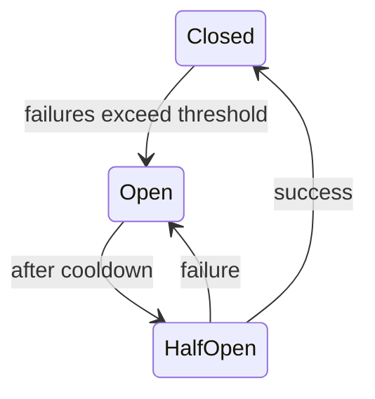

## When Failure Starts to Travel

A service slows down.

Clients retry.  
Queues grow.  
Threads block.

Soon, healthy services start failing too.

Nothing is “broken” —  
but everything is overwhelmed.

This is **cascading failure**.

## The Core Idea

A circuit breaker is a **protective switch**.

It answers one question:

> **Should we keep calling a service that is clearly unhealthy?**

Sometimes the safest call  
is **not calling at all**.

## A Simple Analogy: Electrical Circuits

In your home:

- too much current → breaker trips
- power stops flowing
- damage is prevented

You don’t wait for wires to melt.

You cut the connection.

That’s exactly what circuit breakers do in software.

## How Circuit Breakers Behave

A circuit breaker usually has three states:

- **Closed** — calls flow normally  
- **Open** — calls are blocked immediately  
- **Half-open** — a few test calls are allowed  

The goal is simple:
- fail fast
- reduce pressure
- allow recovery

## Visualizing a Circuit Breaker

This isn’t complexity.

It’s controlled hesitation.

## Why Circuit Breakers Matter

Without circuit breakers:
- retries amplify failures
- slow services drag others down
- outages spread horizontally

With circuit breakers:
- failures are contained
- healthy systems stay responsive
- recovery becomes possible

## ⚠️ Common Trap

**Trap:** Relying only on retries.

Retries keep pressure on failing systems.

Circuit breakers **remove pressure**.

Both are needed — but for different reasons.

## How This Connects to What We’ve Learned

- **Timeouts, Retries, and Backpressure**  
  Decide when calls fail.  
  [https://vivekmolkar.com/posts/timeouts-retries-backpressure/](https://vivekmolkar.com/posts/timeouts-retries-backpressure/)

- **Sharding**  
  Failures affect specific machines.  
  [https://vivekmolkar.com/posts/sharding/](https://vivekmolkar.com/posts/sharding/)

- **Replication**  
  Slow replicas can trigger breakers.  
  [https://vivekmolkar.com/posts/replication/](https://vivekmolkar.com/posts/replication/)

Circuit breakers protect the system as a whole.

> 
**Retries try harder.  
Circuit breakers know when to stop.**
{: .prompt-tip}

## 🧪 Mini Exercise

Think about a dependency you call often.

1. What failure rate is acceptable?
2. When should calls stop entirely?
3. How does the system recover?

If you don’t answer these,  
your outage will.

## What Comes Next

Once failures are contained…

> **How do systems remain useful even when parts are down?**

Next: **Graceful Degradation**  
Designing useful failure instead of total collapse.

