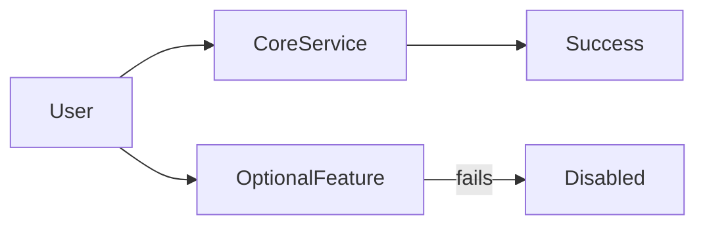

## When “Working” Becomes a Spectrum

Most systems don’t fail all at once.

They lose small things first.

- recommendations disappear  
- images don’t load  
- search becomes slower  
- some features quietly stop responding  

The system is still up.  
But it’s not fully itself anymore.

This isn’t a bug.

This is **graceful degradation**.

## The Core Idea

Graceful degradation means:

> **When parts of a system fail,  
> the system remains useful — just less capable.**

Instead of:
- total outage

You get:
- partial functionality
- reduced guarantees
- controlled behavior

Failure becomes **intentional**, not chaotic.

## A Simple Story: The Power Cut

When power goes out:

- emergency lights turn on  
- elevators stop  
- non-essential systems shut down  

The building doesn’t collapse.

It enters **survival mode**.

That’s graceful degradation.

## Why Total Failure Is the Worst Outcome

When everything depends on everything else:
- one failure cascades
- retries amplify load
- systems collapse together

Graceful degradation breaks this chain.

It allows systems to:
- shed load
- protect core paths
- preserve trust

## What Usually Degrades First

Systems often degrade:
- optional features
- non-critical data
- expensive computations
- background tasks

What stays up:
- core workflows
- essential writes
- critical reads

This is not accidental.

It’s a design choice.

## Visualizing Degradation

The goal is simple:

> **Protect the core, sacrifice the edges.**

## ⚠️ Common Trap

**Trap:** Treating all features as equally critical.

This leads to:
- all-or-nothing systems
- fragile dependencies
- outages caused by “nice-to-have” features

Not everything deserves the same reliability budget.

## How This Connects to What We’ve Learned

- **Circuit Breakers**  
  Stop unhealthy dependencies.  
  [https://vivekmolkar.com/posts/circuit-breakers/](https://vivekmolkar.com/posts/circuit-breakers/)

- **Timeouts, Retries, and Backpressure**  
  Prevent overload before collapse.  
  [https://vivekmolkar.com/posts/timeouts-retries-backpressure/](https://vivekmolkar.com/posts/timeouts-retries-backpressure/)

- **Sharding & Replication**  
  Limit blast radius during failure.  
  [https://vivekmolkar.com/posts/sharding/](https://vivekmolkar.com/posts/sharding/)

Graceful degradation is the *policy layer* above them all.

> 
**A system that does less is better than a system that does nothing.**
{: .prompt-tip}

## 🧪 Mini Exercise

Take a system you know.

1. What is its *core* responsibility?
2. What could be turned off safely?
3. What must never fail?

If you can’t answer these,  
your system will decide under pressure.

## What Comes Next

Now that systems can survive failure…

> **How should they be structured as they grow?**

Next: **Monolith vs Microservices**  
Why this is usually the wrong question.
