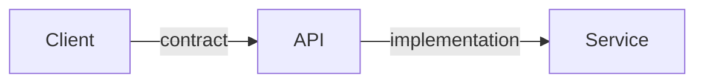

## The Bug That Wasn’t a Bug

I’ve seen APIs “break” without any code changes.

No deploy.  
No outage.  
No errors.

Just… clients behaving strangely.

That’s when it becomes clear:

> **APIs don’t fail because of code.  
> They fail because of broken expectations.**

## The Core Idea

An API is not just a function call.

It is a **contract**.

A promise that defines:
- what inputs are accepted
- what outputs are returned
- what errors mean
- what will *not* change silently

Code can change freely.

Contracts cannot.

## Where Things Go Wrong

Many APIs are designed like this:

- “Here’s the endpoint”
- “Here’s the payload”
- “We’ll adjust it later if needed”

This works — until someone depends on it.

Once clients integrate:
- changes become breaking
- “small tweaks” cause outages
- versioning becomes painful

The problem wasn’t implementation.

It was design.

## A Simple Analogy: The Elevator Button

When you press an elevator button:

- you don’t know how motors work
- you don’t care about wiring
- you expect one thing: **it takes you up**

If the button suddenly:
- changes floors
- behaves differently
- requires a new gesture

People lose trust.

APIs work the same way.

## What a Good API Contract Includes

A good contract answers clearly:

- What does this endpoint do?
- What inputs are required vs optional?
- What responses are guaranteed?
- What errors can occur?
- What stays backward compatible?

Notice what’s missing.

No implementation details.

## Visualizing Contract vs Code

Clients depend on **contracts**.  
Services depend on **code**.

Mixing the two causes pain.

## ⚠️ Common Trap

**Trap:** Letting clients rely on undocumented behavior.

“Everyone knows this field is always present.”

Until one day it isn’t.

Undocumented behavior *is* part of the contract —  
just an accidental one.

## How This Connects to What We’ve Learned

- **Monolith vs Microservices**  
  More services = more contracts to manage.  
  [https://vivekmolkar.com/posts/monolith-vs-microservices/](https://vivekmolkar.com/posts/monolith-vs-microservices/)

- **Graceful Degradation**  
  Contracts define how failure is communicated.  
  [https://vivekmolkar.com/posts/graceful-degradation/](https://vivekmolkar.com/posts/graceful-degradation/)

- **Circuit Breakers**  
  Errors must be predictable to be handled safely.  
  [https://vivekmolkar.com/posts/circuit-breakers/](https://vivekmolkar.com/posts/circuit-breakers/)

APIs are the *surface area* of your system.

> 
**Code can be refactored.  
Contracts must be respected.**
{: .info-tip}

## 🧪 Mini Exercise

Pick an API you own.

1. What guarantees does it make?
2. What would break if a field disappeared?
3. Which behaviors are accidental?

If you can’t answer these, your clients already know the answers — painfully.

## What Comes Next

Once APIs exist…

> **Should calls block and wait,  
> or move independently through time?**

Next: **Synchronous vs Asynchronous Systems**

