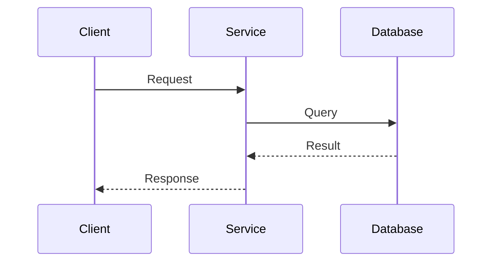
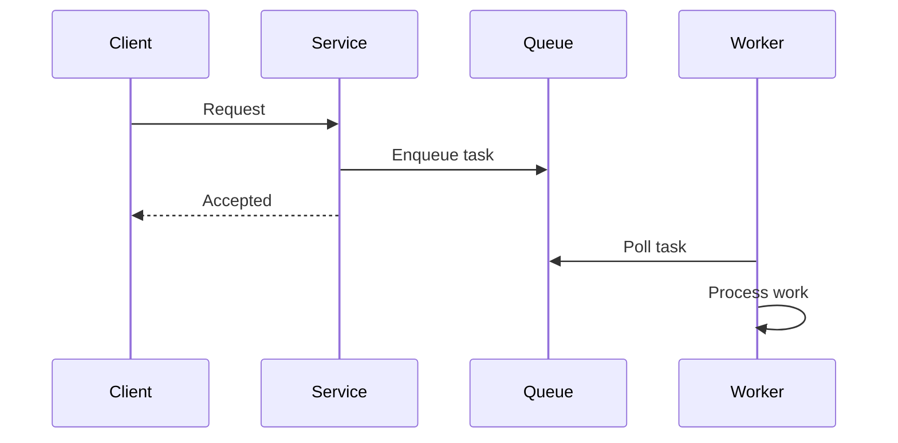

## I Used to Think This Was Just About Speed

For a long time, I thought synchronous vs asynchronous was about performance.

One is “faster”.  
The other is “more scalable”.

That framing felt neat.

It was also incomplete.

What I eventually realized is this:

> **This distinction is really about waiting.**

Who waits.  
For how long.  
And what happens while they do.

## A Small Moment That Changed My Understanding

I remember staring at an API call that looked harmless.

Client → Service → Database → Response.

Everything was “working”.

But the client was waiting.  
Threads were blocked.  
Retries were piling up.

Nothing had failed yet.

But the system felt… tense.

That’s when it clicked:

> **Synchronous systems make waiting visible.  
> Asynchronous systems try to relocate it.**

## What Synchronous Really Means (In Practice)

In a synchronous system:

- a request is sent
- the caller waits
- nothing else happens until a response comes back

It feels simple because it is.

### Synchronous Flow

During this time:
- the client is blocked
- threads are occupied
- failure propagates quickly

Synchronous systems assume:

> “The thing I’m calling will respond soon.”

That assumption is fragile.

## What Asynchronous Really Means (In Practice)

In an asynchronous system:

- work is handed off
- the caller moves on
- results arrive later (or elsewhere)

Nothing magical happens here.

We’re just changing **who waits**.

### Asynchronous Flow

Now:
- the client is free
- the system absorbs time
- waiting exists — but is controlled

Asynchronous systems assume:

> “Waiting will happen. Let’s design where it lives.”

## This Is Not About Choosing One

Early on, I tried to “pick a side”.

That was the wrong instinct.

Real systems are mixed.

- user-facing flows are often synchronous
- background work is asynchronous
- boundaries are intentional, not ideological

The real question is never:

> “Sync or async?”

It is:

> **“Where can waiting safely exist?”**

## A Simple Mental Model

If a user is staring at a screen:
- synchronous feels honest

If work may take time:
- asynchronous feels respectful

Waiting isn’t bad.

**Uncontrolled waiting is.**

## A Quiet Failure Mode

One of the most dangerous designs I’ve seen is:

- synchronous calls
- with asynchronous expectations

“We assume it’ll be quick.”

Until it isn’t.

That’s how:
- timeouts appear
- retries explode
- systems fail under *normal* load

## How This Connects to What We’ve Learned

- API contracts decide who waits  
  [https://vivekmolkar.com/posts/api-design-contracts-over-code/](https://vivekmolkar.com/posts/api-design-contracts-over-code/)

- Circuit breakers stop endless waiting  
  [https://vivekmolkar.com/posts/circuit-breakers/](https://vivekmolkar.com/posts/circuit-breakers/)

- Backpressure is waiting made explicit  
  [https://vivekmolkar.com/posts/timeouts-retries-backpressure/](https://vivekmolkar.com/posts/timeouts-retries-backpressure/)

- Graceful degradation chooses what can wait  
  [https://vivekmolkar.com/posts/graceful-degradation/](https://vivekmolkar.com/posts/graceful-degradation/)

> 
**Time always exists in a system.  
Design decides where it accumulates.**
{: .info-tip}

## A Small Exercise

Think about a system you work on.

- Where do requests wait?
- Who feels the delay?
- What happens when waiting grows?

If you can answer that,
you understand more than most diagrams show.

## What Comes Next

Once systems stop waiting on each other directly…

> **How do they communicate without tight coupling?**

Next: **Event-Driven Architecture (When Time Matters)**
