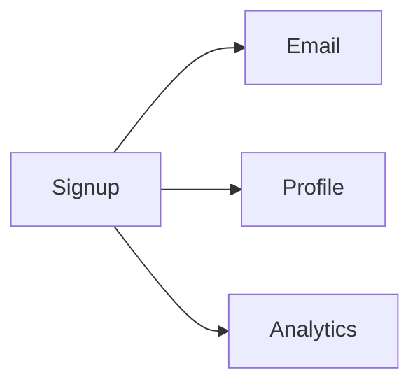
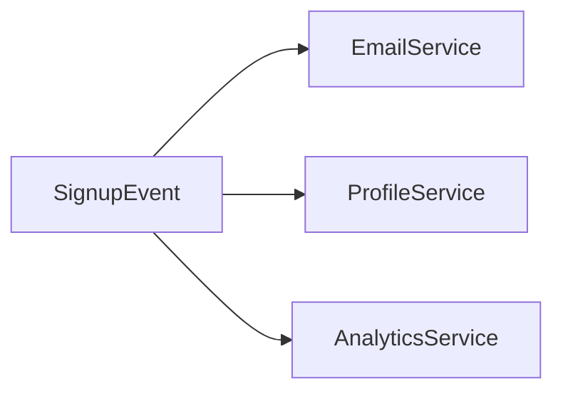

## This Didn’t Click for Me Immediately

When I first heard “event-driven architecture”, it sounded… fancy.

Events. Streams. Consumers.

It felt like a pattern you adopt *after* your system becomes complex.

What I didn’t realize then was this:

> **Event-driven systems are not about complexity.  
> They’re about respecting time.**

## A Small Friction I Kept Ignoring

I remember adding a feature that looked harmless.

User signs up → send welcome email → create profile → update analytics → notify another service.

All in one request.

It worked.

Until it didn’t.

The request got slower.  
Failures started leaking across concerns.  
One small change meant touching many places.

Nothing was “wrong”.  
But the system felt tightly wound.

## What Changed My Thinking

At some point, I stopped asking:

> “How do I make this faster?”

And started asking:

> **“Does this really need to happen *now*?”**

That question changed everything.

## What Event-Driven Really Means

In an event-driven system:

- something *happens*
- the system records that fact
- interested parts react in their own time

Instead of:
> “Do this, then that, then that…”

We say:
> **“This happened.”**

And we let time flow.

## A Simple Example

A user signs up.

That is the *event*.

What follows:
- send email
- create profile
- update analytics
- notify downstream systems

These are *reactions*, not dependencies.

The signup doesn’t wait for them.

## Visualizing the Shift

### Before: Tight Coupling

### After: Event-Driven

Now:
- failures are isolated
- time is absorbed
- the system breathes

## This Is Not About Queues Alone

Queues help.

But event-driven thinking is deeper than tooling.

It’s about:
- decoupling responsibilities
- allowing partial failure
- accepting eventual consistency
- designing for growth you can’t predict

## ⚠️ A Common Misunderstanding

**Trap:** Turning everything into events.

Not everything deserves to be asynchronous.

If a user expects a result *now*:
- make it synchronous
- make it explicit
- fail clearly

Event-driven systems shine when:
> **time is flexible, but correctness matters.**

## How This Connects to What We’ve Learned

- **Synchronous vs Asynchronous Systems**  
  [https://vivekmolkar.com/posts/synchronous-vs-asynchronous-systems/](https://vivekmolkar.com/posts/synchronous-vs-asynchronous-systems/)

- **Graceful Degradation**  
  [https://vivekmolkar.com/posts/graceful-degradation/](https://vivekmolkar.com/posts/graceful-degradation/)

- **Retries and Backpressure**  
  [https://vivekmolkar.com/posts/timeouts-retries-backpressure/](https://vivekmolkar.com/posts/timeouts-retries-backpressure/)

These ideas were quietly pointing here.

> 
**Events describe reality.  
Services decide how to respond.**
{: .info-tip}

## A Small Exercise

Think about a flow you own.

- Which steps truly must happen now?
- Which could happen later?
- Which failures should *not* affect the user?

If you can answer this,
you’re already thinking event-driven.

## What Comes Next

Once systems start reacting to events…

> **How do we control access and trust?**

Next: **Authentication vs Authorization**
