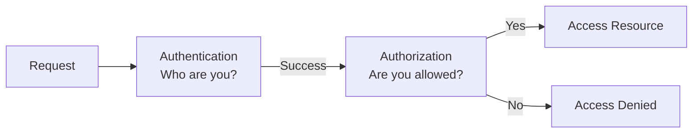

## I Used to Mix These Up

For a long time, authentication and authorization lived in the same mental bucket for me.

Login logic.  
Tokens.  
Permissions.

I could define both, but I didn’t *feel* the difference.

That changed the first time a system behaved correctly…  
and still did the wrong thing.

## The Analogy That Finally Helped

Think of entering an office building.

At the entrance:
- security checks your ID
- confirms you’re an employee

That’s **authentication**.

Once inside:
- you still can’t enter every room
- some floors are restricted
- certain doors need extra permission

That’s **authorization**.

Being allowed *inside* does not mean being allowed *everywhere*.

## Where I First Saw This Go Wrong

A user was logged in.

Everything looked fine:
- valid token
- active session
- no errors

Yet the user could access data belonging to another account.

Nothing crashed.  
No alerts fired.

The system trusted the user’s identity —  
but never checked their *permission*.

That’s when it clicked:

> **Authentication answers “Who are you?”  
> Authorization answers “What are you allowed to do?”**

## Authentication: Establishing Identity

Authentication is about **identity**.

The system asks:
- Who is making this request?
- Can I trust that claim?

Once this is done, the system knows *who* you are.

And that’s where authentication stops.

It does **not** decide:
- what data you can see
- what actions you can perform
- which resources you can touch

## Authorization: Enforcing Boundaries

Authorization is about **permission**.

Now the system asks:
- Is this user allowed to do *this*?
- On *this* resource?
- In *this* context?

This is where:
- roles
- ownership
- policies
- edge cases

start to matter.

And where most real bugs hide.

## Visualizing the Difference

## Why Mixing Them Is Dangerous

A subtle but common mistake:

> “The user is authenticated, so they should be allowed.”

Authentication gives identity.  
Authorization grants capability.

When identity is treated as permission:
- data leaks happen
- privilege escalation sneaks in
- bugs stay invisible until damage is done

## Where Systems Quietly Drift

Over time, authorization logic often spreads everywhere.

A role check here.  
An ownership check there.  
Some assumptions baked into code paths.

Eventually:
- nobody knows the full policy
- rules contradict each other
- security becomes accidental

The system still works.

Trust doesn’t.

## How This Connects to What We’ve Already Covered

- **API Design (Contracts Over Code)**  
  Contracts define *who* can call *what* — authentication identifies the caller, authorization enforces the contract.  
  [https://vivekmolkar.com/posts/api-design-contracts-over-code/](https://vivekmolkar.com/posts/api-design-contracts-over-code/)

- **Synchronous vs Asynchronous Systems**  
  Just like we made *waiting* explicit there, authentication vs authorization makes *trust* explicit.  
  [https://vivekmolkar.com/posts/synchronous-vs-asynchronous-systems/](https://vivekmolkar.com/posts/synchronous-vs-asynchronous-systems/)

- **Event-Driven Architecture (When Time Matters)**  
  Decoupling reactions only works when services trust *events* but still authorize *actions*.  
  [https://vivekmolkar.com/posts/event-driven-architecture-when-time-matters/](https://vivekmolkar.com/posts/event-driven-architecture-when-time-matters/)

- **Graceful Degradation**  
  Degrading features safely often depends on *what a user is allowed to access*, not just whether they’re logged in.  
  [https://vivekmolkar.com/posts/graceful-degradation/](https://vivekmolkar.com/posts/graceful-degradation/)

## A Small Exercise

Think about a system you work on.

- Where does authentication happen?
- Where does authorization live?
- Is permission enforced centrally — or scattered?

If the answer is “a bit everywhere”, that’s a signal.

> 
**Authentication opens the door.  
Authorization decides how far you can walk.**
{: .prompt-tip}

Confusing the two is easy.

Undoing the damage is not.

## What Comes Next

Once trust is established…

> **How do we stay fair — even when users abuse the system?**

Next: **Rate Limiting (Fairness Under Abuse)**

