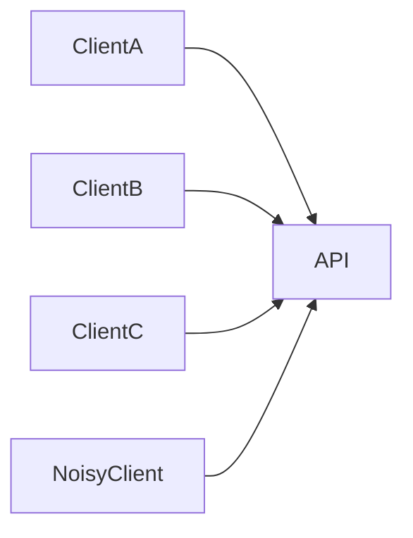
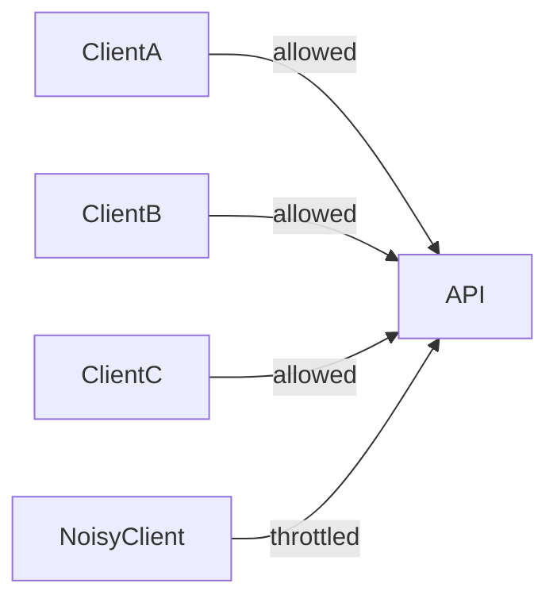

## I Used to Think This Was About Blocking Bad Users

For a long time, I thought rate limiting was a security feature.

Stop attackers.  
Block bots.  
Protect APIs.

That framing isn’t wrong — but it misses the core idea.

What finally made it click for me was this:

> **Rate limiting is not about intent.  
> It’s about protecting shared capacity.**

## The Analogy That Made It Obvious

Think of a playground slide.

The rule is simple:

> **Only one child at a time on the slide.  
> Wait until the person in front reaches the bottom — then it’s your turn.**

You can’t push everyone at once and go zoom‑zoom‑zoom together.
The slide would break.
Kids would crash.
Someone would cry.

So the teacher enforces a tiny wait:
one kid → wait → next kid → wait.

No one is being punished.  
The slide is just a shared resource.

That’s rate limiting.

## Where It Became Real for Me

The system looked healthy.

Servers were up.  
Latency was fine.  
No errors.

Then one perfectly valid client started sending requests in a tight loop.

Nothing failed outright.

But:

- queues grew
- retries amplified traffic
- other users felt the system slow down

The system had no way to say:

> “You’re allowed — just not all at once.”

## What Rate Limiting Really Answers

Rate limiting answers one question:

> **How much of a shared resource can one actor consume over time?**

An _actor_ could be:

- a user
- an API key
- an IP address
- a service
- a tenant

Rate limiting doesn’t judge intent.

It enforces **fair access**.

## Visualizing the Problem

### Without Rate Limiting

Everyone competes freely.
The loudest client wins.

### With Rate Limiting

Now:

- requests are spaced out
- the system stays usable
- fairness is preserved

## Why This Comes After Authentication & Authorization

Authentication answers **who** you are.  
Authorization answers **what** you can do.

Rate limiting decides:

> **How often you’re allowed to do it.**

Even trusted users can overwhelm a system —
especially with retries, loops, or background jobs.

Trust without limits is fragile.

## A Common Trap

**Trap:** “We’ll add rate limiting at the API gateway.”

That helps — but it’s incomplete.

Because:

- internal services can overload each other
- retries multiply traffic
- background jobs don’t respect user limits

Rate limiting is not just an edge feature.

It’s a **system design choice**.

## A Small Exercise

Think about your system.

- What is the shared resource?
- Who could dominate it accidentally?
- What happens today when demand spikes?

If the answer is “everyone slows down” —
that’s the cost of missing limits.

> **A healthy system spaces work out  
> before it has to shut things down.**
> {: .prompt-tip}

That’s rate limiting.

## What Comes Next

Once limits exist…

> **How do we see when they’re hit — and why?**

Next: **Observability (Knowing What Is Actually Happening)**

## How This Connects to the Series

- **Authentication vs Authorization** defines trust  
  [https://vivekmolkar.com/posts/authentication-vs-authorization/](https://vivekmolkar.com/posts/authentication-vs-authorization/)

- **Retries & Backpressure** amplify or control load  
  [https://vivekmolkar.com/posts/timeouts-retries-backpressure/](https://vivekmolkar.com/posts/timeouts-retries-backpressure/)

- **Rate Limiting** enforces fairness at the boundary  
  [https://vivekmolkar.com/posts/rate-limiting-fairness-under-abuse/](https://vivekmolkar.com/posts/rate-limiting-fairness-under-abuse/)

Different tools.
Same goal:
protect shared systems from unbounded demand.
