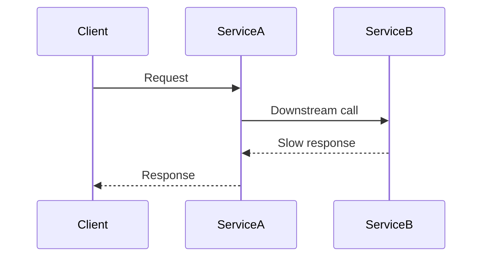

## The Worst Bugs I’ve Seen Had One Thing in Common

Nothing was down.

No crashes.  
No alarms.  
No obvious failures.

Users just said:

> “Sometimes it feels slow.”

That sentence is dangerous.

Because _sometimes_ means:

- you can’t reproduce it easily
- you can’t measure it reliably
- you can’t be sure your fix worked

And yet — something is clearly wrong.

## What I Tried First (And Why It Failed)

I did what most of us do.

Checked CPU.  
Checked memory.  
Checked error rates.

Everything looked normal.

I could tell the system was **alive**.  
I couldn’t tell what it was **doing**.

That distinction matters.

## The Analogy That Finally Locked It In

Think of debugging a production issue with **only server uptime**.

You know:

- the server is running
- requests are being accepted
- nothing has crashed

But you don’t know:

- which request is slow
- which dependency caused it
- whether it’s the same path every time

Now imagine debugging the same issue with a **full request timeline**:

- request enters the system
- spends 120ms in service A
- waits 800ms on service B
- retries once
- finally succeeds

Nothing about the system changed.

Only your ability to **see the path** did.

That’s observability.

> **Monitoring tells you the system is alive.  
> Observability shows you what the system actually did.**

## What Observability Actually Means

Observability is not about collecting more data.

It’s about being able to **explain behavior**.

For any request, you should be able to answer:

- where the time went
- which component slowed things down
- what made this request different

If the answer involves guesswork,  
observability is missing.

## Why Green Dashboards Are a Trap

Dashboards usually show **averages**.

Averages hide pain.

If:

- 95% of requests are fast
- 5% are extremely slow

The average still looks fine.

But users don’t experience averages.  
They experience **their request**.

That’s why tail latency matters.

## Visualizing Observability

Observability lets you see _where time was spent_,  
not just that time was spent.

## Logs, Metrics, Traces — One Mental Model

This is how I hold it:

- **Metrics** tell you _something is wrong_
- **Logs** tell you _what happened_
- **Traces** tell you _where and why_

None of them alone is enough.

Observability is how they connect.

## Why This Becomes Non‑Negotiable in Distributed Systems

As systems grow:

- delays stack
- retries amplify load
- failures become partial

Nothing breaks cleanly.

Without observability:

- fixes are guesses
- teams argue
- confidence erodes

The system keeps running.  
Understanding doesn’t.

## A Quick Self‑Test

Think about the last production issue you saw.

Could you explain:

- where the time went?
- why only some users were affected?
- why the issue disappeared on its own?

If not, observability was missing.

## How This Connects to the Series

- **Rate Limiting — Fairness Under Abuse**  
  [https://vivekmolkar.com/posts/rate-limiting-fairness-under-abuse/](https://vivekmolkar.com/posts/rate-limiting-fairness-under-abuse/)

- **Timeouts, Retries, and Backpressure**  
  [https://vivekmolkar.com/posts/timeouts-retries-backpressure/](https://vivekmolkar.com/posts/timeouts-retries-backpressure/)

- **Circuit Breakers**  
  [https://vivekmolkar.com/posts/circuit-breakers/](https://vivekmolkar.com/posts/circuit-breakers/)

These mechanisms protect systems.

Observability is how you _see_ them working — or failing.

> **A system that cannot explain a request end‑to‑end  
> is already broken — even if it’s still serving traffic.**
> {: .info-tip}

Observability doesn’t prevent incidents.

It prevents confusion.

## What Comes Next

Once you can see clearly…

> **How do you design systems that survive change?**

Next: **Designing for Change**
