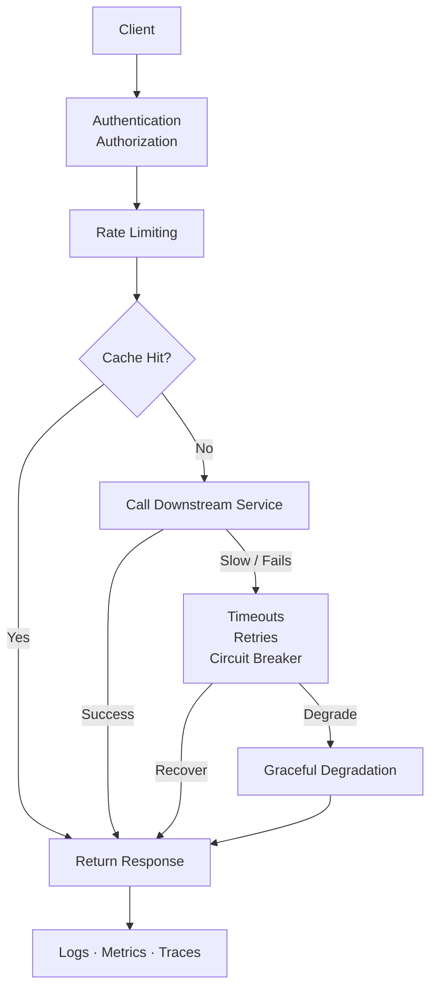

## Until Now, We’ve Been Learning Pieces

We talked about:
- sync vs async
- caching
- rate limiting
- retries
- observability
- designing for change

Each topic made sense on its own.

But real systems don’t fail in isolation.

They fail when **multiple small decisions interact**.

This post is about seeing that interaction clearly.

## The System We’ll Walk Through

Let’s design something intentionally boring:

> **A simple content API**  
Users request a list of items.  
The system returns them.

Nothing fancy.  
Just enough complexity to matter.

## Walkthrough: End-to-End Request Flow

> Every box here exists to make failure smaller, earlier, or more explainable.

## Step 1: Trust Comes First

When a request arrives, the first questions are simple:

- Is this request authenticated?
- Is the user authorized to access this data?

If trust is unclear, we reject early.

Cheaply.  
Calmly.

## Step 2: Controlling Entry

Now assume the user is valid.

Next question:

> How often are they allowed to do this?

Without rate limiting:
- one noisy client can dominate capacity
- retries amplify load
- fairness disappears

So before touching business logic, we enforce limits.

Not to punish.  
To protect everyone else.

## Step 3: Shaping Load with Caching

If the data is cacheable, we check the cache.

- Cache hit → fast response, minimal load
- Cache miss → continue downstream

Caching here is not an optimization.

It’s a **load-shaping decision**.

## Step 4: Calling Downstream Services

Now things get interesting.

We must decide:
- sync or async
- timeout duration
- retry behavior

A single retry feels harmless.

At scale, retries multiply pressure.

So retries are:
- bounded
- deliberate
- paired with timeouts

## Step 5: Failing Gracefully

If a dependency is slow or failing:

- we don’t wait forever
- we don’t retry endlessly

We apply:
- timeouts
- circuit breakers
- graceful degradation

The goal is simple:

> Fail in a controlled way.

## Step 6: Understanding What Happened

When something feels off, we ask:

- Where did the time go?
- Which dependency slowed things down?
- Was this request different?

If we can’t answer that, everything above becomes guesswork.

Observability turns confusion into explanation.

## Step 7: Surviving the Next Change

Now imagine:
- traffic doubles
- a new feature is added
- a new consumer appears

If this system has:
- clear boundaries
- explicit contracts
- observable behavior

Change hurts less.

If not, every change becomes a gamble.

## What This Walkthrough Is Really About

This isn’t about one system.

It’s about a way of thinking:

- Protect shared resources
- Make limits explicit
- Expect partial failure
- Design for explanation
- Assume change will come

No single decision saves you.

Together, they make systems **boringly reliable**.

> 
**System design is not choosing the right box.  
It’s choosing how failures behave.**
{: prompt-tip}

Everything else is secondary.

## What Comes Next

We’ve seen the pieces.  
We’ve seen them together.

Now we step back and ask:

> **What did we actually learn?**

Next: **System Design Is a Way of Thinking**
