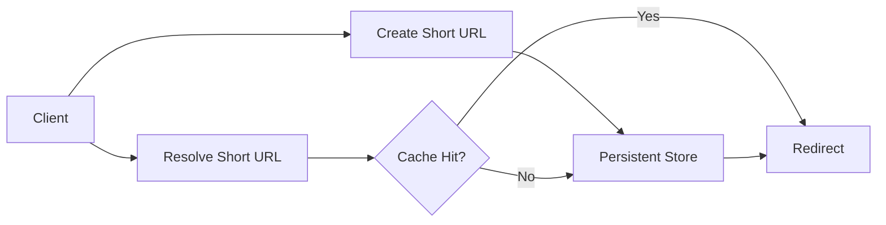
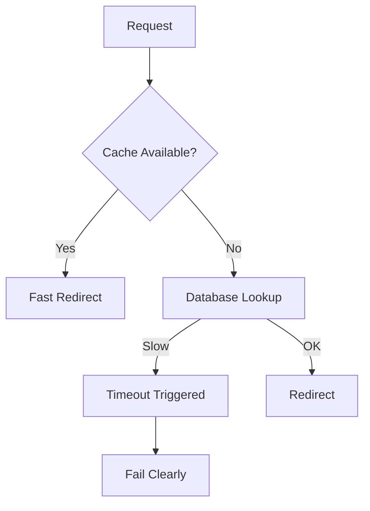

A URL shortener looks harmless.

You take a long URL.  
You return a short one.  
When someone clicks it, you redirect.

That’s it.

And yet, this tiny system quietly forces you to confront some of the most important system design questions very early.

The first thing I try to do is resist jumping to components.

Before databases, caches, or IDs, I want to understand what actually matters here.

What hurts if it goes wrong?

If a link breaks, that’s permanent damage.  
If a redirect is slow, users feel it immediately.  
If the system hangs, people retry and make things worse.

So a few things are already clear:

- correctness matters more than write speed  
- the read path is the hot path  
- quiet slowness is more dangerous than loud failure  

Those aren’t features.  
They’re pressures.

Once that’s clear, the shape of the system starts to form.

There are really only two paths worth thinking about.

One creates links.  
The other resolves them.

Creation is rare.  
Resolution is constant.

That asymmetry does most of the work for us.

## Where the Time Goes

Almost all pressure sits on the resolve path.

That’s where latency matters.  
That’s where caching becomes unavoidable.  
That’s where failure needs to be controlled.

Now the first real decision shows up, almost quietly.

Where does the mapping live?

If we lose the mapping, links die forever. There is no recovery.

So the source of truth has to be durable. A database fits naturally here. Not because it’s sophisticated, but because the cost of losing data is too high.

Once that decision is made, several others fall into place.

Caching is no longer a question of performance.  
It becomes a question of survival.

Redirects happen constantly.  
The same short URLs get hit again and again.  
Most traffic concentrates on a small set of popular links.

So we cache mappings from short key to long URL.

But there’s an important boundary here.

The cache is never the source of truth.

If it fails, the system slows down.  
If the database fails, the system fails clearly.

That separation is deliberate.

## Failure Behavior Under Load

Quiet slowness is worse than visible failure.

Timeouts, limits, and fallbacks define how the system behaves when stressed.  
They are not afterthoughts.

Abuse is another quiet pressure point.

A URL shortener is easy to misuse.

Without limits, one client can:
- generate millions of links
- flood the database
- create redirect storms

Rate limiting belongs at the boundary.

Not as a security feature.  
As a fairness one.

Even small systems deserve visibility.

If someone reports:
“Some links are slow”  
or  
“Some links don’t work”

I want answers.

I should be able to tell:
- whether the request hit the cache
- how long the database lookup took
- whether a timeout fired
- how long the redirect took end to end

Observability turns guessing into explanation.

Finally, I like to pause and ask one uncomfortable question.

What change would hurt this design the most?

If links become editable, cache invalidation gets hard fast.  
If strict analytics are added, the read path needs isolation.  
If traffic grows unevenly, hot keys become a real problem.

None of these break the design immediately.

They stress assumptions.

When I step back, this case study is not really about shortening URLs.

It’s about:
- separating correctness from performance
- shaping load intentionally
- failing clearly
- making assumptions visible

## What I Hold Onto

> 
Simple systems are not simple because they lack decisions.  
They are simple because the decisions are clear.
{: .prompt-tip}

## Further Reading

If you want deeper context on ideas used here:

- Caching  
  [https://vivekmolkar.com/posts/caching/](https://vivekmolkar.com/posts/caching/)

- Rate Limiting  
  [https://vivekmolkar.com/posts/rate-limiting-fairness-under-abuse/](https://vivekmolkar.com/posts/rate-limiting-fairness-under-abuse/)

- Observability  
  [https://vivekmolkar.com/posts/observability/](https://vivekmolkar.com/posts/observability/)

- Designing for Change  
  [https://vivekmolkar.com/posts/designing-for-change/](https://vivekmolkar.com/posts/designing-for-change/)
