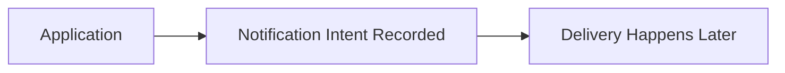
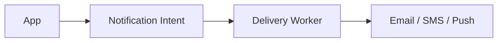

Notifications are easy to underestimate.

You send an email.  
You send an SMS.  
You send a push.

Nothing looks complicated until you ask one simple question.

Should the user have to wait for it?

Imagine a checkout flow.

The user clicks “Place Order”.  
Now the system wants to send a confirmation email.

Do we wait until the email is delivered?

If we do, a few things immediately feel wrong.

- email providers are slow  
- providers go down  
- retries take time  

A user action is now coupled to someone else’s infrastructure.

That’s uncomfortable.

So maybe we don’t wait.

Maybe we send the email in the background.

That sounds obvious, but it hides a real design decision.

If the app doesn’t wait, then something else must remember to send the notification.

This is the first real pressure point.

Where does that responsibility live?

At this point, I usually stop and write one sentence.

“The application should decide that a notification must be sent,  
but not how or when it is delivered.”

That sentence creates a boundary.

Once that boundary exists, the shape of the system starts to form.

The application records an intent.  
Then it walks away.

Delivery becomes someone else’s problem.

Words start getting clumsy here, so I draw it.

The diagram looks simple, but it makes the boundary visible.

The application is done once the intent is recorded.

Everything after that is decoupled.

Now another question shows up almost immediately.

What happens if delivery fails?

Email providers fail.  
SMS gateways throttle.  
Push services go quiet.

So delivery must retry.

But retries have a dangerous property.

They multiply traffic when the system is already stressed.

Blind retries turn small failures into floods.

That tells me something important.

Retries cannot live in the application.

They need a controlled execution environment.

So I redraw the picture.

Now the thinking is visible.

- the app stays fast  
- the queue absorbs pressure  
- workers control retries  
- providers are isolated  

We didn’t start here.

We arrived here because the simpler options broke under pressure.

Retries still need rules.

How often do we retry?  
How long do we wait?  
When do we stop?

Retrying forever feels safe, but it isn’t.

At some point, retrying just hides a bigger failure.

So retries need limits.

They also need space between attempts.

This is where backpressure quietly enters the design.

Not as a feature.  
As a safety mechanism.

At this point, another uncomfortable issue appears.

Duplicates.

If a worker sends a notification and crashes before acknowledging it, the message might be sent again.

That sounds bad until you slow down.

For many notifications, duplicates are acceptable.  
For some, they are not.

This is not a technical decision first.

It’s a product decision.

You either:
- design delivery to be idempotent  
- or accept occasional duplication  

What matters is knowing which one you chose.

One thing becomes clear as the system grows.

Failures here are quiet.

Users don’t always complain about missing notifications.  
Sometimes they don’t even notice.

So the system has to speak up for itself.

I want to see:
- queue depth over time  
- delivery success and failure rates  
- retry counts  
- provider latency  

If these numbers drift, something is wrong long before users tell you.

Observability is not optional here.

Near the end, I ask the question I always ask.

What change would hurt this design the most?

If notification volume spikes:
- queues grow  
- workers fall behind  

If a provider enforces stricter limits:
- retries need tuning  
- backpressure must engage earlier  

If new channels are added:
- delivery logic must stay isolated  
- the application flow should not change  

None of these break the system immediately.

They test assumptions.

When I step back, this system is not really about notifications.

It’s about respecting boundaries.

The application should move on quickly.  
Delivery should be controlled and isolated.  
Failures should slow things down, not spread.

Asynchronous design is not about speed.

It’s about containment.

> 
Systems fail most quietly where users are least attentive.  
That’s where design discipline matters most.
{: .prompt-tip}

## Further Reading

If you want deeper context on ideas used here:

- Synchronous vs Asynchronous Systems  
  [https://vivekmolkar.com/posts/synchronous-vs-asynchronous-systems/](https://vivekmolkar.com/posts/synchronous-vs-asynchronous-systems/)

- Retries and Backpressure  
  [https://vivekmolkar.com/posts/timeouts-retries-backpressure/](https://vivekmolkar.com/posts/timeouts-retries-backpressure/)

- Graceful Degradation  
  [https://vivekmolkar.com/posts/graceful-degradation/](https://vivekmolkar.com/posts/graceful-degradation/)

- Observability  
  [https://vivekmolkar.com/posts/observability/](https://vivekmolkar.com/posts/observability/)
