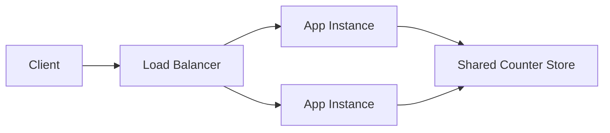

## Designing a Distributed Rate Limiter

Rate limiting sounds simple until you try to do it fairly.

Allow 100 requests per minute.  
Block the rest.

That’s the sentence everyone starts with.

The trouble begins the moment the system stops being single-node.

## What Are We Actually Protecting?

I usually start with a slightly uncomfortable question.

What exactly are we trying to protect?

Is it:
- the database
- the application servers
- a downstream dependency
- or other users

The answer matters, because rate limiting is not about denial.  
It is about fairness under pressure.

## When the Naive Approach Breaks

Let’s take a concrete situation.

We have an API.  
It’s behind a load balancer.  
Requests land on many instances.

Traffic spikes.

Some clients behave well.  
Some don’t.

If we get this wrong, the loud ones win.

## Why Local Counters Stop Working

The naive approach shows up fast.

Each server tracks how many requests it has seen from a client.  
If the count crosses a threshold, it blocks.

That feels reasonable.  
And it works.  
Until it doesn’t.

A client making 1000 requests might hit 10 servers.  
Each server sees 100.  
Each server thinks everything is fine.

The system as a whole is being abused.  
No single node notices.

## The Moment Shared State Becomes Necessary

At this point, I pause.

Rate limiting decisions need shared context.

So I write down what the system actually needs.

- a way to count requests across instances
- a consistent view of limits
- a decision that applies everywhere

That tells me something important.

Rate limiting state cannot live only in process memory.

Words get fuzzy here, so I draw the simplest possible picture.

Now the shape of the problem is visible.

Every request needs to:
- identify who it belongs to
- update a shared counter
- decide allow or block

Correctness improves.  
Latency gets worse.

## The Cost of Fairness

This is where trade-offs show up clearly.

A strongly consistent counter gives fairness.  
It also adds contention and latency.

A loosely consistent counter improves speed.  
It allows some burstiness.

There is no free option here.

So the question becomes simpler.

Where do we tolerate error?

Most systems choose:
- slight inaccuracies
- short windows
- bounded bursts

Fairness over time matters more than perfection per request.

## When the Limiter Becomes the Bottleneck

Another uncomfortable issue appears next.

What happens when the counter store is slow or unavailable?

If every request waits on it, the entire system slows down.

Now rate limiting, which was supposed to protect the system, is harming it.

That’s a bad inversion.

So we add a rule.

If the limiter cannot decide quickly, it should fail deliberately.  
Not hang.

Which way it fails depends on what you are protecting.

This is where rate limiting stops being a library choice and becomes system design.

## A Failure That Made This Real

I’ve seen this go wrong once.

A public API endpoint went viral overnight.  
Traffic jumped by an order of magnitude.  
The shared counter store became the bottleneck.  
Requests piled up waiting for rate limit checks.  
Healthy application servers sat idle while latency exploded.

Nothing was technically down.  
The system was unusable.

## Where Rate Limiting Should Live

At this point, the design starts to settle.

- limits are enforced at the boundary
- shared state exists, but is accessed carefully
- decisions are fast
- inaccuracies are tolerated in short windows

Just as important:

Rate limiting is not scattered through business logic.  
It lives in one place.  
It is observable.  
It is adjustable.

## What Breaks This Design First?

Near the end, I ask the same question again.

What change would hurt this design the most?

If traffic patterns shift suddenly, thresholds may be wrong.  
If clients rotate identities, fairness breaks down.  
If limits become dynamic, coordination gets harder.

None of these invalidate the approach.

They remind you that rate limiting is a living boundary.

When I step back, this case study is not really about counting requests.

It’s about enforcing fairness when the system no longer has a single point of view.

Distributed systems lose global truth by default.  
Rate limiting forces you to decide how much truth you need.

> 
Fairness is easy on one machine.  
It becomes a design problem the moment you scale.
{: .prompt-tip}

## Further Reading

If you want deeper context on ideas used here:

- Stateless vs Stateful Systems  
[  https://vivekmolkar.com/posts/stateless-vs-stateful/](  https://vivekmolkar.com/posts/stateless-vs-stateful/)

- Consistency Models  
  [https://vivekmolkar.com/posts/consistency-models/](https://vivekmolkar.com/posts/consistency-models/)

- Backpressure and Retries  
  [https://vivekmolkar.com/posts/timeouts-retries-backpressure/](https://vivekmolkar.com/posts/timeouts-retries-backpressure/)

- Single Point of Failure  
  [https://vivekmolkar.com/posts/single-point-of-failure/](https://vivekmolkar.com/posts/single-point-of-failure/)
