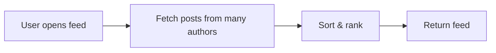
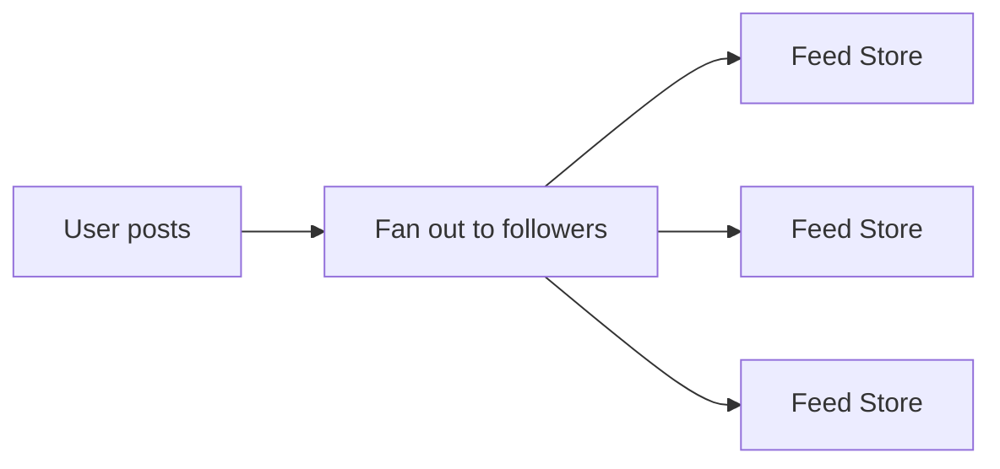

## Designing a News Feed

A news feed looks simple.

A list of posts.  
Newest at the top.  
Scroll until you’re bored.

That simplicity hides the first real question.

## Who Is Doing the Work?

When a user opens their feed, work has to happen.

Posts need to be gathered.  
They need to be ordered.  
They need to be returned quickly.

So I start here.

When should this work happen?

- when someone creates a post  
- or when someone reads their feed  

That single choice shapes almost everything.

## What Happens If We Do the Work on Read?

Let’s try the obvious option first.

A user opens the app.  
We fetch posts from people they follow.  
We sort them by time.  
We return the result.

Clean. Understandable.

So I ask the next question.

How often does this path run?

Users read feeds constantly.  
They refresh.  
They scroll.  
They come back minutes later and do it again.

Posting is rare.  
Reading is not.

That tells me something uncomfortable.

The read path is hot.  
Very hot.

## Where Does This Start to Hurt?

Every feed request now:
- fans out to many authors
- hits storage repeatedly
- applies filters and ordering

That cost repeats on every refresh.

This is where words stop helping, so I draw it.

All the work happens on read.

That’s convenient for writers.  
Painful for readers.

## What If We Flip the Pressure?

At this point, a different question appears naturally.

What if we do the work earlier?

Instead of assembling feeds on read, we push new posts into followers’ feeds when the post is created.

Now reads are cheap.  
Writes are expensive.

Posting is rare.  
Reading is constant.

This feels promising.

But I don’t trust it yet.

## Where Does the Cost Go Now?

If we flip the pressure, the system shape changes.

One write turns into many writes.

The more followers you have, the more work the system does.

That leads to the next question.

## What Happens When Someone Is Very Popular?

Imagine a user with a million followers.

They post once.

That single action now means:
- a million feed updates
- a million writes
- a million chances to fail or slow down

So I pause again.

Did we solve the problem, or just move it?

## Why Neither Extreme Is Comfortable

Pure fan-out on read:
- hurts latency
- punishes frequent readers

Pure fan-out on write:
- explodes for popular accounts
- creates long queues and lag

Neither extreme survives real-world skew.

That’s the actual design tension.

Not feeds.  
Not ranking.  
Timing.

## Where Compromise Starts Making Sense

This is usually where the thinking shifts.

Feeds do not need perfect freshness.  
They need to feel fast and mostly right.

That opens the door to a mixed approach.

- precompute feeds for most users  
- store recent items  
- serve reads quickly from cache  

For extreme cases:
- very large accounts  
- viral posts  

Fall back to on-read computation or partial fan-out.

Not because it’s elegant.  
Because it survives.

## Why Caching Becomes a First-Class Decision

Another question helps clarify this.

What do users actually do with feeds?

They refresh.  
They scroll back.  
They reopen the app.

The same feed is requested again and again.

Serving that repeatedly from storage is wasteful.

Caching here is not an optimization.  
It’s how the system breathes under load.

## A Failure That Changes How You Think

I’ve seen this go wrong once.

A celebrity post triggered massive fan-out writes.  
Queues backed up.  
Feed updates lagged for hours.  
Users refreshed endlessly, making the load worse.

Nothing crashed.  
Everything slowed down.

That kind of failure recalibrates your instincts.

## What Signals Tell Us the Feed Is Healthy?

Feeds fail quietly.

So I want to see:
- feed generation latency  
- cache hit ratios  
- fan-out queue depth  
- delay between post time and feed appearance  

Without these, you don’t know if the system is broken or just busy.

## What Breaks This Design First?

Near the end, I ask the question I’ve learned to trust.

What change would hurt this the most?

If follows spike suddenly, fan-out cost rises.  
If ranking gets complex, precomputation suffers.  
If freshness expectations tighten, caching loses power.

None of these invalidate the design.

They change where work belongs.

> 
Systems fail when all the work is pushed to the same moment.  
Good design spreads the cost across time.
{: .prompt-tip}

## Further Reading

If you want deeper context on ideas used here:

- Read-Heavy vs Write-Heavy Systems  
  [https://vivekmolkar.com/posts/read-heavy-vs-write-heavy-systems/](https://vivekmolkar.com/posts/read-heavy-vs-write-heavy-systems/)

- Caching  
  [https://vivekmolkar.com/posts/caching/](https://vivekmolkar.com/posts/caching/)

- Asynchronous Systems  
  [https://vivekmolkar.com/posts/synchronous-vs-asynchronous-systems/](https://vivekmolkar.com/posts/synchronous-vs-asynchronous-systems/)

- Backpressure  
  [https://vivekmolkar.com/posts/timeouts-retries-backpressure/](https://vivekmolkar.com/posts/timeouts-retries-backpressure/)
