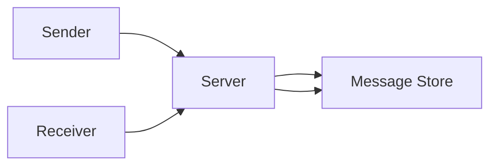
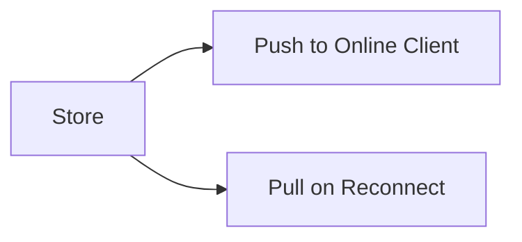
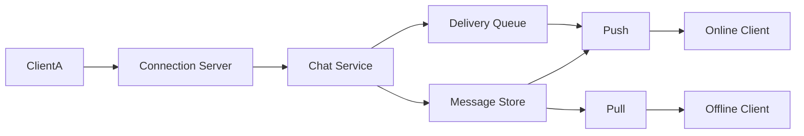

## Designing a Real-Time Chat System

## What Does “Send Message” Actually Mean?

Someone types a message.  
They hit send.

At first, “send” feels binary.

But the moment you slow down, it splits.

Is the message:
- accepted by the server
- delivered to the other user
- stored safely
- shown on the receiver’s screen

Those are different moments in time.

So we decide something early.

**“Sent” means accepted and safely stored by the system.**

Delivery can happen later.  
Visibility can lag.

## Who Needs to Be Online?

Does delivery require the receiver to be online?

If yes, messages disappear when users disconnect.  
That’s fragile.

So we choose the safer option.

**Messages must be delivered even if the receiver is offline.**

That immediately implies storage.

## Where Does Message State Live?

Message state becomes unavoidable.

We need:
- a place to store messages
- a way to retrieve them later
- a way to track progress per user

The server mediates.

## Is Ordering Important?

Messages arrive over the network.  
Retries happen.  
Multiple devices send concurrently.

Order matters.

Within a conversation, users expect messages to appear in sequence.

So we decide:

**The server assigns order.**

## What Happens When Things Go Wrong?

Failures are normal.

We choose one invariant.

**Messages should not be lost.**

Duplicates are acceptable.  
Loss is not.

## What Does “Real-Time” Actually Mean?

Real-time is about perception, not physics.

Users don’t need instant delivery.  
They need continuity.

Consistency beats raw speed.

Push is the fast path.  
Storage-backed pull is the guarantee.

## How Does Delivery Actually Happen?

## Is This a Fan-Out Problem?

One-to-one chat is simple.  
Group chat is not.

Fan-out returns.

## What Breaks First at Scale?

Large groups expose pressure.

- connection count
- fan-out cost
- ordering coordination
- storage growth
- silent lag

Each needs containment.

## Putting It All Together

> 
Chat systems are not about speed.  
They are about trust that messages will arrive.
{: .prompt-tip}

## What We Already Know

If parts of this felt familiar, that’s intentional. This case study stands on ideas we’ve already built earlier in the series.

- **Synchronous vs Asynchronous Systems**  
  Chat feels real-time, but reliable delivery depends on async thinking. Push is fast. Storage-backed pull is the safety net.  
  [https://vivekmolkar.com/posts/synchronous-vs-asynchronous-systems/](https://vivekmolkar.com/posts/synchronous-vs-asynchronous-systems/)

- **Notifications and Quiet Failure**  
  Message delivery has the same failure modes as notifications. Messages can lag or disappear quietly if we don’t design for retries and visibility.  
  [https://vivekmolkar.com/posts/case-study-notification-system/](https://vivekmolkar.com/posts/case-study-notification-system/)

- **Retries, Backpressure, and Containment**  
  Fan-out delivery and reconnect storms behave like retry floods. Backpressure is what keeps small issues from cascading.  
  [https://vivekmolkar.com/posts/timeouts-retries-backpressure/](https://vivekmolkar.com/posts/timeouts-retries-backpressure/)

- **Rate Limiting and Fairness Under Load**  
  Group chats turn message delivery into a fairness problem. Without limits and isolation, loud conversations starve others.  
  [https://vivekmolkar.com/posts/case-study-distributed-rate-limiter/](https://vivekmolkar.com/posts/case-study-distributed-rate-limiter/)

These ideas don’t disappear in chat systems.  
They resurface under tighter expectations and more visible failure.
